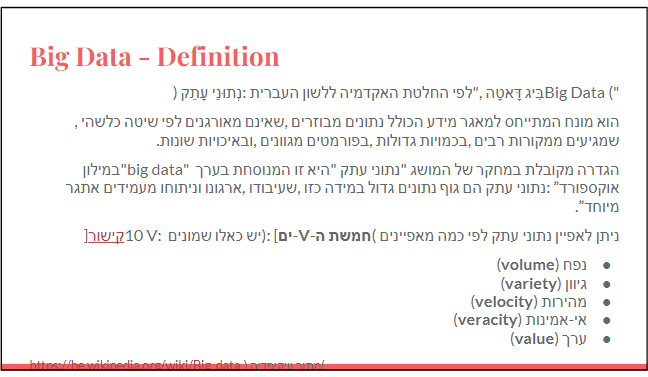

### what is big data?
  
- Big data is a term that describes the large volume of data – both structured and unstructured – that inundates a business on a day-to-day basis. But it’s not the amount of data that’s important. It’s what organizations do with the data that matters. Big data can be analyzed for insights that lead to better decisions and strategic business moves.

### 5 V's of big data:
1. **Volume**: The quantity of generated and stored data. The size of the data determines the value and potential insight- and whether it can actually be considered big data or not.
2. **Variety**: The type and nature of the data. This helps people who analyze it to effectively use the resulting insight. Big data draws from text, images, audio, video; plus it completes missing pieces through data fusion.
3. **Velocity**: In this context, the speed at which the data is generated and processed to meet the demands and challenges that lie in the path of growth and development. Big data is often available in real-time.
4. **Veracity**: The quality of captured data can vary greatly, affecting accurate analysis. Data quality can be affected by a number of factors: The data sources may be unreliable, for example. Big data must be cleaned and corrected.
5. **Value**: It’s not the amount of data that’s important. It’s what organizations do with the data that matters. Big data can be analyzed for insights that lead to better decisions and strategic business moves.

### another definition:

Big data primarily refers to datasets that are too large or complex to be dealy with by traditional data-processing application software. Big data is a term applied to data sets whose size or type is beyond the ability of traditional relational databases to capture, manage, and process the data with low-latency.

### Volume:
Today Terabyte size DB are common, so we may define big as being hundreds of terabytes or petabytes of data. The volume of data is important.

### Table of Volume

