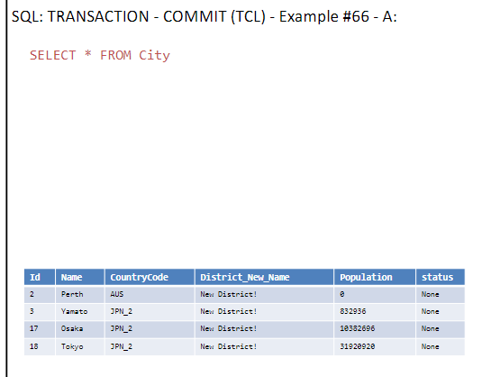

# Lesson Notes

## Fifth lesson 8.5.24

## Author's 

This document was written by Yaniv Gabay. While every effort has been made to ensure the accuracy and completeness of this material, it is possible that it may contain errors or omissions. Readers are advised to use this material as a general guide and to verify information with appropriate professional sources.
in order to see the pictures taken from the presentation, please make sure you cloned the pictures themselves.

## Previous Lesson Recap


### FIND ALL TRANSACTION THAT ARE MORE THAN *3 OF THE PREVIOUS ONE


```sql
WITH  lag_t as (
SELECT *,
LAG(amount) OVER (ORDER BY day,hour) as lag_a
FROM sales s1 
)
SELECT *
FROM lag_t
ORDER BY day, hour  
```
results:


we want to add the *3 part of the question:

```sql
WITH  lag_t as (
SELECT *,
LAG(amount) OVER (ORDER BY day,hour) as lag_a
FROM sales s1 
)
SELECT *
FROM lag_t
WHERE amount > 3 * lag_a 
ORDER BY day, hour
```
results:


wrong  querry:
```sql
SELECT *
FROM lag_t
WHERE amount > 3 * LAG(amount) OVER (ORDER BY day,hour)
ORDER BY day, hour
```
this WONT work, cus the the window function, is the last operationit will do, but the WHERE runs before, so this WONT work

### same questions, but now within the same day


```sql
WITH  lag_t as (
SELECT *,
LAG(amount) OVER (PARTITION BY day ORDER BY hour) as 
lag_a
FROM sales s1 
)
SELECT *
FROM lag_t
ORDER BY day, hou
```
results:


we want to add the *3 part of the question:

```sql
WITH  lag_t as (
SELECT *,
LAG(amount) OVER (PARTITION BY day ORDER BY hour) as 
lag_a
FROM sales s1 
)
SELECT *
FROM lag_t
WHERE amount > 3 * lag_a 
ORDER BY day, hour
```
results:


## Lesson 5

### Recursion
syntax is "WITH RECURSIVE"
//select 1 does a col that all of it 1
```sql
WITH RECURSIVE cnt(x) AS ( --- select from table cnt, the col x
    SELECT 1 --- put 1 in the col x
    UNION ALL --- this help us add new lines to the table
    SELECT x+1 FROM cnt WHERE x < 9 --- keep adding 1 to x, as long as x is smaller than 9 (join the table with itself)
)
SELECT x FROM cnt
```
results:


another example:
```sql
WITH RECURSIVE cnt(x) AS (
    SELECT 1
    UNION ALL
    SELECT x+1 FROM cnt
    LIMIT 9
)
SELECT x FROM cnt
```
results:


### Hierarchial Queries Examples
if we wanted to get the highet of my boss, we did self join.
and if we wanted the highet of the boss of my boss,its much better to use recursion.

org = our table
```sql
WITH  works_for_bob(n) AS (
SELECT 'Bob'
UNION
SELECT name 
FROM org, works_for_bob
WHERE org.boss = works_for_bob.n --- n = name
)
SELECT * 
FROM works_for_bob
```
results:
    

another example:

```sql
WITH  works_for_bob(n) AS (
SELECT 'Bob'
UNION
SELECT name 
FROM org, works_for_bob
WHERE org.boss = works_for_bob.n
)
SELECT avg(height) FROM org
WHERE org.name IN (SELECT n FROM works_for_bob)
```
results:


another example:


```sql
WITH  under_alice(name,level) AS (
SELECT 'Alice',0
UNION ALL
SELECT org.name, under_alice.level+1
FROM org JOIN under_alice ON org.boss=under_alice.name
ORDER BY 2 ASC
)
SELECT level, substr('..........',1,level*3) || name 
FROM under_alice
```
results:
  

another example:

```sql
WITH RECURSIVE  under_alice(name,level) AS (
SELECT 'Alice',0
UNION ALL
SELECT org.name, under_alice.level+1
FROM org JOIN under_alice ON org.boss=under_alice.name
ORDER BY 2 DESC
)
SELECT level, substr('..........',1,level*3) || name 
FROM under_alice
```
results:


### JSON
JSON is a data format that is easy to read and write for humans and easy to parse and generate for machines. JSON is a text format that is completely language independent but uses conventions that are familiar to programmers of the C family of languages, including C, C++, C#, Java, JavaScript, Perl, Python, and many others. These properties make JSON an ideal data-interchange language.

JSON in sql:

```sql
SELECT id, data,
json(data) json_data
FROM json_valu
```
results:


basicly just cleaned the data(removed spaces etc)

another example:
   
```sql
SELECT id, data,
json_valid(data) is_json_valid
FROM json_valu
```
results:

so this will give us for every value (row) if the json format is valid or not (1 or 0)

another example:

```sql
SELECT *, json_extract(data,pp) 
FROM json_value, json_path
```
results:
   
so its similar to full joins etc, but for json
so for every key, we get the value of it (multiply times)
so we will have the same key multiple times, but with different values.

### SQL CREATE

#### Create Table

```sql
CREATE TABLE "City" 
( "Id" INTEGER PRIMARY KEY NOT NULL, -- auto rowid
"Name" TEXT NOT NULL DEFAULT '', 
"CountryCode" TEXT NOT NULL DEFAULT '', 
"District" TEXT DEFAULT '', 
"Population" INTEGER NOT NULL DEFAULT 0 )
```
another example:

```sql
CREATE TABLE IF NOT EXISTS "Country" 
( "Code" TEXT NOT NULL, 
"Name" TEXT NOT NULL, 
"Continent" TEXT NOT NULL, 
"Region" TEXT NOT NULL, 
"SurfaceArea" REAL NOT NULL, 
"IndepYear" INTEGER, 
"Population" INTEGER NOT NULL, 
"LifeExpectancy" REAL, 
"GNP" REAL, 
"GNPOld" REAL, 
"Capital" INTEGER, 
"Code2" TEXT NOT NULL, 
PRIMARY KEY ("Code") )

```
another example:

```sql
CREATE TABLE "CountryLanguage" 
( "CountryCode" TEXT NOT NULL, 
"Language" TEXT NOT NULL, 
"IsOfficial" INTEGER NOT NULL DEFAULT 0, 
"Percentage" REAL NOT NULL, 
PRIMARY KEY ("CountryCode","Language") )
```

### Show Tables

```sql
SELECT name table_name
FROM sqlite_schema
WHERE type ='table' 
AND name NOT LIKE 'sqlite_%'
```

### Insert Rows

```sql
INSERT INTO "City" 
("ID", "Name", "CountryCode", "District", "Population") 
VALUES (NULL, 'Kabul', 'AFG', 'Kabol', 1780000)
```
another example:

```sql
INSERT INTO "City" 
("ID", "Name", "CountryCode", "District") 
VALUES (NULL, 'Perth', 'AUS', 'West Australia')
```
another example:

```sql
INSERT INTO "City" 
("ID", "Name", "CountryCode", "District", "Population") 
VALUES (NULL, 'Yamato', 'JPN', 'Kanagawa', '208234')
```

```sql
SELECT * FROM City
```

### Insert Many Rows

```sql
INSERT INTO "City" 
("ID", "Name", "CountryCode", "District", "Population") 
VALUES (17, 'Osaka', 'JPN', 'Osaka', '2595674'),
(NULL, 'Tokyo', 'JPN', 'Tokyo-to', '7980230'),
(NULL, 'Haifa', 'ISR', 'Haifa', '265700'),
(NULL, 'Jerusalem', 'ISR', 'Jerusalem', '633700')
```

results:


### CTAS (Create Table As)

```sql
CREATE TABLE city_millions AS 
SELECT Name city_name, Population/1000000.0 
population_million 
FROM City
```
another example:

```sql
SELECT name table_name
FROM sqlite_schema
WHERE type ='table' 
AND name NOT LIKE 'sqlite_%'
```
Results:


### Update Rows

```sql
UPDATE "City"
SET District = 'New District!'
```
this will update all rows, we PROBALLY DONT want it

results:


### Update Some Rows

```sql
UPDATE "City"
SET  CountryCode = 'JPN_2',
Population = Population * 4
WHERE CountryCode = 'JPN'
```
This is just for rows that filter is true (and we also use the old val to calc new one.)

results:


### Add / Rename Columns (alter Table)

```sql
ALTER TABLE "City"
ADD COLUMN status TEXT
```

another example:

```sql
ALTER TABLE "City"
RENAME COLUMN District TO District_New_Name
```
Results:


### Delete Some Rows

```sql
DELETE FROM "City"
WHERE CountryCode = 'ISR'
```
results:


### Index

```sql
EXPLAIN QUERY PLAN 
SELECT * FROM Country WHERE Code2='IL  
```
this will explain what he did, basicly he SCANNED the whole country

the index is like a proprety of the table, that helps us to find the data faster.
so whenever a new row is added, the index is updated as well.

```sql
CREATE INDEX new_contry_index
ON Country(Code2);
```


so we use index, and now its much faster:


### Transaction - commit (tcl)

```sql
BEGIN TRANSACTION;
```
this will start a transaction, and we can do many operations, and then commit them all at once.

```sql
DELETE FROM "City"
WHERE CountryCode = 'AFG';
```
```sql
COMMIT TRANSACTION;
```



### Transaction - rollback (tcl)
```sql
BEGIN TRANSACTION;
```
```sql
DELETE FROM "City"
WHERE CountryCode = 'AFG';
```
```sql
ROLLBACK TRANSACTION;
```
will rollback the TRANSACTION


