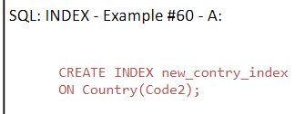
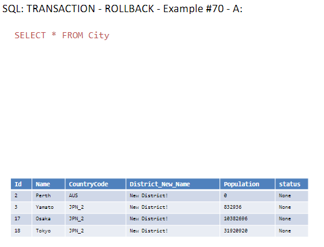

# Lesson Notes

## Fifth lesson 8.5.24

## Author's 

This document was written by Yaniv Gabay. While every effort has been made to ensure the accuracy and completeness of this material, it is possible that it may contain errors or omissions. Readers are advised to use this material as a general guide and to verify information with appropriate professional sources.
in order to see the pictures taken from the presentation, please make sure you cloned the pictures themselves.

## Previous Lesson Recap


### FIND ALL TRANSACTION THAT ARE MORE THAN *3 OF THE PREVIOUS ONE


```sql
WITH  lag_t as (
SELECT *,
LAG(amount) OVER (ORDER BY day,hour) as lag_a
FROM sales s1 
)
SELECT *
FROM lag_t
ORDER BY day, hour  
```
results:


we want to add the *3 part of the question:

```sql
WITH  lag_t as (
SELECT *,
LAG(amount) OVER (ORDER BY day,hour) as lag_a
FROM sales s1 
)
SELECT *
FROM lag_t
WHERE amount > 3 * lag_a 
ORDER BY day, hour
```
results:


wrong  querry:
```sql
SELECT *
FROM lag_t
WHERE amount > 3 * LAG(amount) OVER (ORDER BY day,hour)
ORDER BY day, hour
```
this WONT work, cus the the window function, is the last operationit will do, but the WHERE runs before, so this WONT work

### same questions, but now within the same day


```sql
WITH  lag_t as (
SELECT *,
LAG(amount) OVER (PARTITION BY day ORDER BY hour) as 
lag_a
FROM sales s1 
)
SELECT *
FROM lag_t
ORDER BY day, hou
```
results:


we want to add the *3 part of the question:

```sql
WITH  lag_t as (
SELECT *,
LAG(amount) OVER (PARTITION BY day ORDER BY hour) as 
lag_a
FROM sales s1 
)
SELECT *
FROM lag_t
WHERE amount > 3 * lag_a 
ORDER BY day, hour
```
results:


## Lesson 5

### Recursion
syntax is "WITH RECURSIVE"
//select 1 does a col that all of it 1
```sql
WITH RECURSIVE cnt(x) AS ( --- select from table cnt, the col x
    SELECT 1 --- put 1 in the col x
    UNION ALL --- this help us add new lines to the table
    SELECT x+1 FROM cnt WHERE x < 9 --- keep adding 1 to x, as long as x is smaller than 9 (join the table with itself)
)
SELECT x FROM cnt
```
results:


another example:
```sql
WITH RECURSIVE cnt(x) AS (
    SELECT 1
    UNION ALL
    SELECT x+1 FROM cnt
    LIMIT 9
)
SELECT x FROM cnt
```
results:


### Hierarchial Queries Examples
if we wanted to get the highet of my boss, we did self join.
and if we wanted the highet of the boss of my boss,its much better to use recursion.

org = our table
```sql
WITH  works_for_bob(n) AS (
SELECT 'Bob'
UNION
SELECT name 
FROM org, works_for_bob
WHERE org.boss = works_for_bob.n --- n = name
)
SELECT * 
FROM works_for_bob
```
results:
    

another example:

```sql
WITH  works_for_bob(n) AS (
SELECT 'Bob'
UNION
SELECT name 
FROM org, works_for_bob
WHERE org.boss = works_for_bob.n
)
SELECT avg(height) FROM org
WHERE org.name IN (SELECT n FROM works_for_bob)
```
results:


another example:


```sql
WITH  under_alice(name,level) AS (
SELECT 'Alice',0
UNION ALL
SELECT org.name, under_alice.level+1
FROM org JOIN under_alice ON org.boss=under_alice.name
ORDER BY 2 ASC
)
SELECT level, substr('..........',1,level*3) || name 
FROM under_alice
```
results:
  

another example:

```sql
WITH RECURSIVE  under_alice(name,level) AS (
SELECT 'Alice',0
UNION ALL
SELECT org.name, under_alice.level+1
FROM org JOIN under_alice ON org.boss=under_alice.name
ORDER BY 2 DESC
)
SELECT level, substr('..........',1,level*3) || name 
FROM under_alice
```
results:


### JSON
JSON is a data format that is easy to read and write for humans and easy to parse and generate for machines. JSON is a text format that is completely language independent but uses conventions that are familiar to programmers of the C family of languages, including C, C++, C#, Java, JavaScript, Perl, Python, and many others. These properties make JSON an ideal data-interchange language.

JSON in sql:

```sql
SELECT id, data,
json(data) json_data
FROM json_valu
```
results:


basicly just cleaned the data(removed spaces etc)

another example:
   
```sql
SELECT id, data,
json_valid(data) is_json_valid
FROM json_valu
```
results:

so this will give us for every value (row) if the json format is valid or not (1 or 0)

another example:

```sql
SELECT *, json_extract(data,pp) 
FROM json_value, json_path
```
results:
   
so its similar to full joins etc, but for json
so for every key, we get the value of it (multiply times)
so we will have the same key multiple times, but with different values.

### SQL CREATE

#### Create Table

```sql
CREATE TABLE "City" 
( "Id" INTEGER PRIMARY KEY NOT NULL, -- auto rowid
"Name" TEXT NOT NULL DEFAULT '', 
"CountryCode" TEXT NOT NULL DEFAULT '', 
"District" TEXT DEFAULT '', 
"Population" INTEGER NOT NULL DEFAULT 0 )
```
another example:

```sql
CREATE TABLE IF NOT EXISTS "Country" 
( "Code" TEXT NOT NULL, 
"Name" TEXT NOT NULL, 
"Continent" TEXT NOT NULL, 
"Region" TEXT NOT NULL, 
"SurfaceArea" REAL NOT NULL, 
"IndepYear" INTEGER, 
"Population" INTEGER NOT NULL, 
"LifeExpectancy" REAL, 
"GNP" REAL, 
"GNPOld" REAL, 
"Capital" INTEGER, 
"Code2" TEXT NOT NULL, 
PRIMARY KEY ("Code") )

```
another example:

```sql
CREATE TABLE "CountryLanguage" 
( "CountryCode" TEXT NOT NULL, 
"Language" TEXT NOT NULL, 
"IsOfficial" INTEGER NOT NULL DEFAULT 0, 
"Percentage" REAL NOT NULL, 
PRIMARY KEY ("CountryCode","Language") )
```

### Show Tables

```sql
SELECT name table_name
FROM sqlite_schema
WHERE type ='table' 
AND name NOT LIKE 'sqlite_%'
```

### Insert Rows

```sql
INSERT INTO "City" 
("ID", "Name", "CountryCode", "District", "Population") 
VALUES (NULL, 'Kabul', 'AFG', 'Kabol', 1780000)
```
another example:

```sql
INSERT INTO "City" 
("ID", "Name", "CountryCode", "District") 
VALUES (NULL, 'Perth', 'AUS', 'West Australia')
```
another example:

```sql
INSERT INTO "City" 
("ID", "Name", "CountryCode", "District", "Population") 
VALUES (NULL, 'Yamato', 'JPN', 'Kanagawa', '208234')
```

```sql
SELECT * FROM City
```

### Insert Many Rows

```sql
INSERT INTO "City" 
("ID", "Name", "CountryCode", "District", "Population") 
VALUES (17, 'Osaka', 'JPN', 'Osaka', '2595674'),
(NULL, 'Tokyo', 'JPN', 'Tokyo-to', '7980230'),
(NULL, 'Haifa', 'ISR', 'Haifa', '265700'),
(NULL, 'Jerusalem', 'ISR', 'Jerusalem', '633700')
```

results:


### CTAS (Create Table As)

```sql
CREATE TABLE city_millions AS 
SELECT Name city_name, Population/1000000.0 
population_million 
FROM City
```
another example:

```sql
SELECT name table_name
FROM sqlite_schema
WHERE type ='table' 
AND name NOT LIKE 'sqlite_%'
```
Results:


### Update Rows

```sql
UPDATE "City"
SET District = 'New District!'
```
this will update all rows, we PROBALLY DONT want it

results:


### Update Some Rows

```sql
UPDATE "City"
SET  CountryCode = 'JPN_2',
Population = Population * 4
WHERE CountryCode = 'JPN'
```
This is just for rows that filter is true (and we also use the old val to calc new one.)

results:


### Add / Rename Columns (alter Table)

```sql
ALTER TABLE "City"
ADD COLUMN status TEXT
```

another example:

```sql
ALTER TABLE "City"
RENAME COLUMN District TO District_New_Name
```
Results:


### Delete Some Rows

```sql
DELETE FROM "City"
WHERE CountryCode = 'ISR'
```
results:


### Index

```sql
EXPLAIN QUERY PLAN 
SELECT * FROM Country WHERE Code2='IL  
```
this will explain what he did, basicly he SCANNED the whole country

the index is like a proprety of the table, that helps us to find the data faster.
so whenever a new row is added, the index is updated as well.

```sql
CREATE INDEX new_contry_index
ON Country(Code2);
```


so we use index, and now its much faster:


### Transaction - commit (tcl)

```sql
BEGIN TRANSACTION;
```
this will start a transaction, and we can do many operations, and then commit them all at once.

```sql
DELETE FROM "City"
WHERE CountryCode = 'AFG';
```
```sql
COMMIT TRANSACTION;
```


### Transaction - rollback (tcl)
```sql
BEGIN TRANSACTION;
```
```sql
DELETE FROM "City"
WHERE CountryCode = 'AFG';
```
```sql
ROLLBACK TRANSACTION;
```
will rollback the TRANSACTION



### OLTP vs OLAP
we talked about the difference between OLTP and OLAP
OLTP is online transaction processing, and OLAP is online analytical processing.
OLTP is used for data entry, and OLAP is used for data analysis.

### Where and Window
we talked about why we cant use window function in the WHERE clause.
the WHERE clause is executed before the window function, so we cant use it in the WHERE clause.
so some versions have QUALIFY
```sql
SELECT *
FROM lag_t
QUALIFY amount >3 * LAG(amount) OVER (ORDER BY day,hour)
ORDER BY day, hour
```

### SQL PARSER AND TRANSLATOR (transpiler)
we talked about how we can use a parser to translate sql to another language.

http.sqlglot.com
http.sqlglot in github

SQLGlot is a no dependecy SQL parser and transpiler. It can parse SQL queries and transpile them to other SQL dialects. It can also transpile SQL queries to JSON and YAML.

### View
we talked about views, and how we can use them to save a query, and use it later.

```sql
CREATE VIEW sales_view AS
SELECT *
FROM sales
```
so basicly each time it will create this virtual table, and we can use it later.

it will still be updated when the original table is updated.

### CTAS IS IMPORTANT
CTAS = Create table as
we talked about how important is CTAS, and how we can use it to create a table from a query.
so we create a copy of a table. this will actually create it and save it on the disk.
its a seperate copy, so if we update the original table, the new table will not be updated.
we might see SELECT INTO not recommended, but its the same as CTAS.


### SQL in cloud for big data1
we talked about how we can use SQL in the cloud for big data.
specifically we talked about BigQuery, and how we can use it to run SQL queries on big data.

we can use the sandbox to run queries, and we can use the UI to run queries as well.
so the cloud.google.com/bigquery is the place to go.

one usefull thing we cn use EXCEPT
```sql
SELECT * EXCEPT   --- exccept which cols we want to remove
```
we talked about AWS as well, and how we can use it to run SQL queries on big data.
Amazon Athena is the place to go.
or Amazon Redshift- which is a warehouse

Snowflake is another place to go.

### modern-sql.com
we talked about modern-sql.com, and how we can use it to learn more about SQL.
its like a dictionary for SQL versions, we can see which version has which commands etc.

### sql zoo knnightlab etc


### Optimization For Big Data -Theory for now

### Query Optimization - From amazon athena 
#### Distributed Hash Join
basicly join is a very expensive operation, so we can use distributed hash join to make it faster.
it will create a hash table, and then it will join the tables.

one side will be the build side, and the other side will be the probe side.
the build side will create the hash table, and the probe side will probe the hash table.
so its pass the hash table between the nodes (this table MUST be the smaller one)
(only when doing comparsion joins)

if we did do a join on two BIG tables, its will be better,to split the tables to smaller tables, and then union them.

#### Other Join Types
Queries with complex join conditions for example queries that use LIKE,>,<,!=,IN,OR,AND, etc. can be slow.
cus it will compare each one.
these queries can exceeding the maximum execution time.

Explain will tell you how he plan to do certain things.
Very important , each action cost money in the cloud.

### Optimization Window Functions
Window functions are very powerful, but they can be slow.
you can run out of memory.
first recommendation is :
reduce the size of the window, to do so, you can add a PARITIONED BY clause or narrow the scope of existing PARTITION BY clause.
so if we need window of 3 month, we can do it for 1 month, and then do it again for the next month  and union them.

Sometimes queries with window function can e rewritten without window functions.
for example:
instead of using row_number, to find the top N records, we can use a subquery with a LIMIT clause etc.

### Optimization - Aggregations
Important: Avoid including redundant columns in the GROUP BY clause.
Fewer columns = Less Memory = Faster Query

Numeric Columns also use less memory than strings
better to agg ids than names etc.

Sometimes queries include columns in the group by clause to work around the fact that a column must either be part of the group by clause or an aggregation expression.
Its VERY bad for performance.
Example of this
```sql
SELECT * FROM Country
```
```sql
SELECT * FROM Country
GROUP BY Continent
```
```sql
SELECT Contient,COUNT(*)
FROM Country
GROUP BY Continent
```
```sql
--- if we want to see regions
SELECT Continent,Region,COUNT(*)
FROM Country
GROUP BY Continent,Region
```
this ill work, but its not good for performance.

this will work,
```sql
SELECT Continent,MAX(Region),COUNT(*)
FROM Country
GROUP BY Continent
```

bad example:
this isuseless
```sql
SELECT Continent,continet_id,COUNT(*)
FROM Country
GROUP BY Continent,continet_id
```
to fix this we can write MAX or Arbitery
```sql
SELECT Continent,MAX(continet_id),COUNT(*)
FROM Country
GROUP BY Continent
```

### Optimization - Top N Queries
the order by clause returns the results of the query in a sorted order.
!!IF YOU DONT STRICLY NEED YOUR RESULT TO BE SORTED AVOID ADDING AN ORDER BY CLAUSE!!
also AVOID ADDING ORDER BY TO INNER QUERIES IF THEY ARE NOT STRICLY NECESSARY

Include only the required columns
if you dont need all the columns, dont use them.

### Misc - Optimization
some have support for approximation aggregate functions, like APPROX_COUNT_DISTINCT, APPROX_PERCENTILE, APPROX_QUANTILE, APPROX_TOP_COUNT
why? cus sometimes we dont need the exact number, and we can save time and money.
also %string% is worst than string%

Optimizing LIKE - we can use a regexp than just look for a string.

Use union ALL instead of union, if you dont need to remove duplicates.
Union all conncatenates the record from the first table to the second table, and union does the same but also removes duplicates.
union all is actuall a quick operation in contrast to union.
only if you need to remove duplicates, use union.

### Unload Data
Unload data to S3 or other storage services.
we can use unload to save the data to a file, and then we can use it later.

### Cache
Caching is a technique that stores a copy of data in a cache.
if we have a query that is used many times, we can cache it, and then we can use it later (results will be faster)

### Partitioning
we will continue this next week


