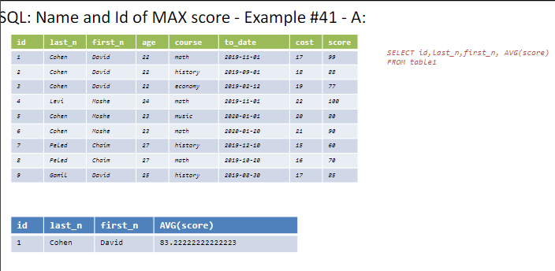
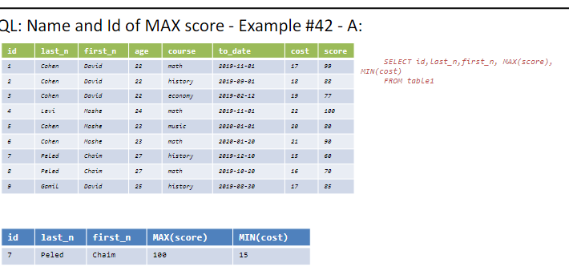
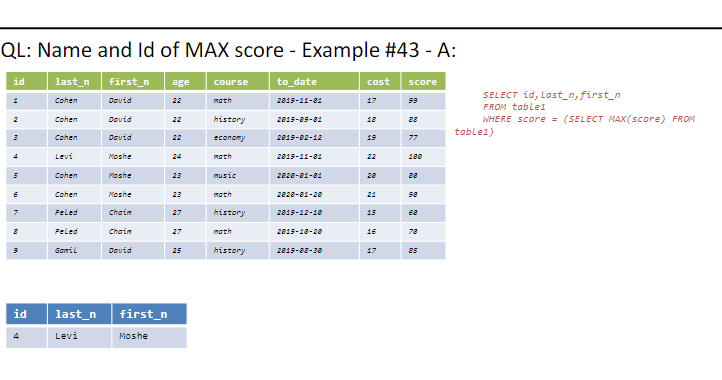
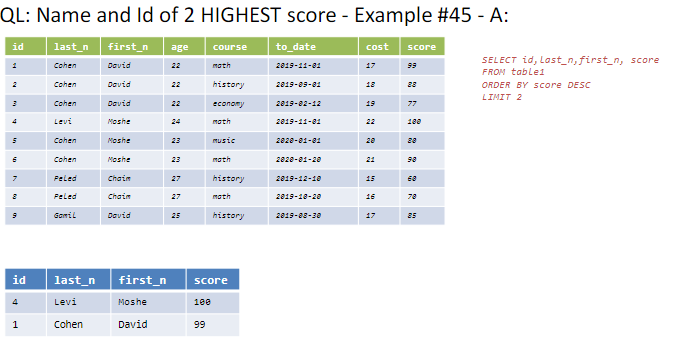
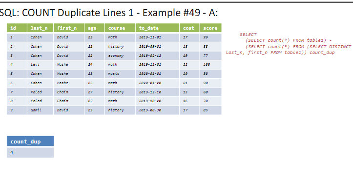
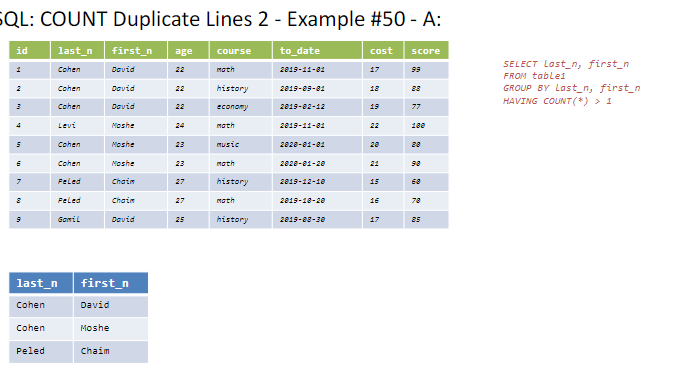
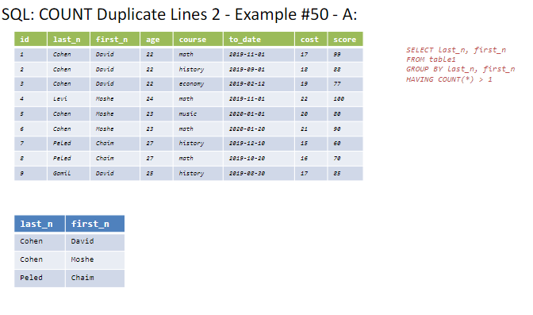
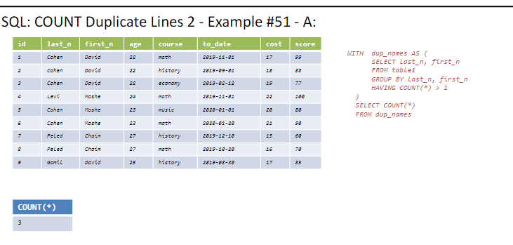
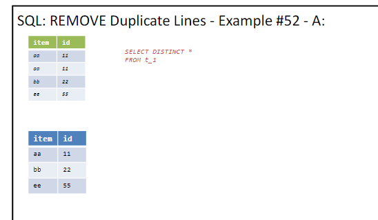

# Lesson Notes

## fourth lesson 1.5.24

## Author's Note

This document was written by Yaniv Gabay. While every effort has been made to ensure the accuracy and completeness of this material, it is possible that it may contain errors or omissions. Readers are advised to use this material as a general guide and to verify information with appropriate professional sources.
in order to see the pictures taken from the presentation, please make sure you cloned the pictures themselves.

## summary of last lesson

### name and id of 2 highest score
```sql
SELECT id,last_n,first_n, score
FROM table1
ORDER BY score DESC
LIMIT 2
```
  
this is a bad example, why it doesnt work.
cus the avgscore isnt relevant to cohen david, but still that row is with the avg score

another "bad" example:
    
we could have fixed this by using group by

the appropriate way to do it is:
    
```sql
SELECT id,last_n,first_n
FROM table1
WHERE score = (SELECT MAX(score) FROM table1)
```

there is a better way, without doing the two querries..

to get the two biggest:
    
```sql
SELECT id,last_n,first_n,score
FROM table1
ORDER BY score DESC
LIMIT 2
```


we will start from the previous slide, and we will add the new slide when we will finish the previous one.

### COUNT DUPLICATE LINES 1
what is a duplicate line.
this query will just give us how many duplicate lines there are, without knowing which row is row etc. just how many duplicates thre are
```sql
SELECT 
(SELECT count(*) FROM table1) -
(SELECT count(*) FROM (SELECT DISTINCT last_n, first_n 
FROM table1)) count_dup
```


if we want to know which rows:


```sql
SELECT last_n, first_n
FROM table1
GROUP BY last_n, first_n
HAVING COUNT(*) > 1
```
this will show us, only the groups, that have duplciates, but NOT how many rows are duplicates.


important , we cant have select COLX that isnt in groupby opeartion

if we want how many from each group:
```sql
SELECT last_n, first_n, COUNT(*)
FROM table1
GROUP BY last_n, first_n
HAVING COUNT(*) > 1
```
IMPORTANT
SELECT cannot affect on the amount of rows, it can only affect on the amount of columns

if we want to count, this results, (3) we can do:

```sql
SELECT COUNT(*) FROM
(
SELECT last_n, first_n
FROM table1
GROUP BY last_n, first_n
HAVING COUNT(*) > 1
) 
```


```sql
WITH  dup_names AS (
SELECT last_n, first_n
FROM table1
GROUP BY last_n, first_n
HAVING COUNT(*) > 1
)
SELECT COUNT(*) 
FROM dup_names
```

if we wanted for each group, how many duplicates there are, we could do:
```sql

SELECT SUM(ss) FROM
(
SELECT last_n, first_n, COUNT(*)-1 as ss
FROM table1
GROUP BY last_n, first_n
HAVING COUNT(*) > 1
) 
```
here , we get the sum, of ss, which is the col, of how many duplicates each group have
the -1 is because we dont want to count the original row, only the duplicates


    
this is the results

### Remove duplicates

```sql
SELECT DISTINCT *
FROM table1
```

