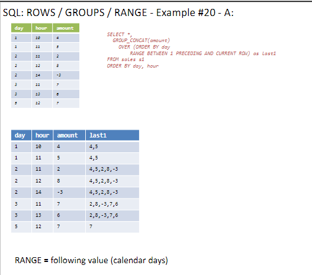

# Lesson Notes

## fourth lesson 1.5.24

## Author's Note

This document was written by Yaniv Gabay. While every effort has been made to ensure the accuracy and completeness of this material, it is possible that it may contain errors or omissions. Readers are advised to use this material as a general guide and to verify information with appropriate professional sources.
in order to see the pictures taken from the presentation, please make sure you cloned the pictures themselves.

## summary of last lesson

### name and id of 2 highest score
```sql
SELECT id,last_n,first_n, score
FROM table1
ORDER BY score DESC
LIMIT 2
```
  
this is a bad example, why it doesnt work.
cus the avgscore isnt relevant to cohen david, but still that row is with the avg score

another "bad" example:
    
we could have fixed this by using group by

the appropriate way to do it is:
    
```sql
SELECT id,last_n,first_n
FROM table1
WHERE score = (SELECT MAX(score) FROM table1)
```

there is a better way, without doing the two querries..

to get the two biggest:
    
```sql
SELECT id,last_n,first_n,score
FROM table1
ORDER BY score DESC
LIMIT 2
```


we will start from the previous slide, and we will add the new slide when we will finish the previous one.

### COUNT DUPLICATE LINES 1
what is a duplicate line.
this query will just give us how many duplicate lines there are, without knowing which row is row etc. just how many duplicates thre are
```sql
SELECT 
(SELECT count(*) FROM table1) -
(SELECT count(*) FROM (SELECT DISTINCT last_n, first_n 
FROM table1)) count_dup
```


if we want to know which rows:


```sql
SELECT last_n, first_n
FROM table1
GROUP BY last_n, first_n
HAVING COUNT(*) > 1
```
this will show us, only the groups, that have duplciates, but NOT how many rows are duplicates.


important , we cant have select COLX that isnt in groupby opeartion

if we want how many from each group:
```sql
SELECT last_n, first_n, COUNT(*)
FROM table1
GROUP BY last_n, first_n
HAVING COUNT(*) > 1
```
IMPORTANT
SELECT cannot affect on the amount of rows, it can only affect on the amount of columns

if we want to count, this results, (3) we can do:

```sql
SELECT COUNT(*) FROM
(
SELECT last_n, first_n
FROM table1
GROUP BY last_n, first_n
HAVING COUNT(*) > 1
) 
```


```sql
WITH  dup_names AS (
SELECT last_n, first_n
FROM table1
GROUP BY last_n, first_n
HAVING COUNT(*) > 1
)
SELECT COUNT(*) 
FROM dup_names
```

if we wanted for each group, how many duplicates there are, we could do:
```sql

SELECT SUM(ss) FROM
(
SELECT last_n, first_n, COUNT(*)-1 as ss
FROM table1
GROUP BY last_n, first_n
HAVING COUNT(*) > 1
) 
```
here , we get the sum, of ss, which is the col, of how many duplicates each group have
the -1 is because we dont want to count the original row, only the duplicates


    
this is the results

### Remove duplicates

```sql
SELECT DISTINCT *
FROM table1
```

also

the intersect


union aswell

this is okay, but we dont see the val


best solution, is to use group by and max
   
```sql
SELECT item,id,MAX(val) val
FROM table1
GROUP BY item,id
```
this will remove the duplicates, and also give us a selection, if we want the max dup,etc.

### Simulate FULL OUTER JOIN

```sql
SELECT e.*, w.* 
FROM employees e
LEFT JOIN works w
ON e.id = w.emp_id
UNION
SELECT e.*, w.* 
FROM works w
LEFT JOIN employees e
ON e.id = w.emp_id 
ORDER BY id
```
results:
   

### LEFT JOIN - ON VS WHERE
```sql
SELECT e.*, w.* 
FROM employees e
LEFT JOIN works w
ON e.id = w.emp_id
AND proj_id > 10
```
the LEFT join, will bring all the rows of the left table, but if we have rows that wont match the condition, they will be null in the values missing, ON is part of the JOIN

another example, but WHERE runs after the join

```sql
SELECT e.*, w.* 
FROM employees e
LEFT JOIN works w
ON e.id = w.emp_id
WHERE proj_id > 10
```
results:

so we can see, the where, will remove nulls, and remove the rows that proj_id is > 10.

at this point, we are moving to the next slide (3)
### Windows functions

#### OVER
```sql
SELECT *, SUM(amount) OVER()
FROM sales s1
ORDER BY day,hour
```
without the OVER, this querry is ILEGAL (missing group by), but using 
   
results:

so the results, is the sum, of the col we asked, and it will be added on each row.
its effective, we calc it once the sum, and we add it to each row

another example:
```sql
SELECT *,SUM(amount) OVER() as all_sum, 
        100.0 * amount / SUM(amount) OVER() as percent
FROM sales s1
ORDER BY day,hour
```
now, we can calculate the percent of each row, in comparison to the total sum


results:

if we wanted to do the same without the over function we could have done:
```sql
SELECT *, 
        100.0 * amount / (SELECT SUM(amount) FROM sales) as percent
FROM sales s1
ORDER BY day,hour
```


another example:
```sql
SELECT *,
COUNT(amount) OVER () as count,
MIN(amount) OVER () as min,
AVG(amount) OVER () as avg,
MAX(amount) OVER () as max
FROM sales s1 
ORDER BY day, hour
```


results:


another example:
```sql
SELECT *,
GROUP_CONCAT(day) OVER () as gc_day,
GROUP_CONCAT(amount) OVER () as gc_amount
FROM sales s1 
ORDER BY day, hour
```


results:

group concat is also working.
but the general group by, doesnt work on the window functions, and also the window function does the concat, in any way he will do it. 


### PARTITION BY
```sql
SELECT *,
COUNT(amount) OVER (PARTITION BY day) as count_d,
MIN(amount) OVER (PARTITION BY day) as min_d,
AVG(amount) OVER (PARTITION BY day) as avg_d,
MAX(amount) OVER (PARTITION BY day) as max_d
FROM sales s1 
ORDER BY day, hour
```

results:

it will do the agg only at the partition, but only on the partition, so it will do the agg on each partition, and not on the whole table.
so the window will move, between the partitions, and not on the whole table. so for us the key will be day

next example:


```sql
SELECT *,
GROUP_CONCAT(day) OVER (PARTITION BY day) as gc_day,
GROUP_CONCAT(hour) OVER (PARTITION BY day) as gc_hour,
GROUP_CONCAT(amount) OVER (PARTITION BY day) as 
gc_amount
FROM sales s1 
ORDER BY day, hour
```


another example:
   
results:
  
```sql
SELECT *,
SUM(amount) OVER (PARTITION BY day) as day_sum,
100.0 * amount / SUM(amount) OVER (PARTITION BY day) as 
percent_day  
FROM sales s1 
ORDER BY day, hou
```

   
the results here, will give the perecnt day of that day group
### Build in Window Functions Rows Nums

another example:
   

```sql
SELECT *,
row_number() OVER (ORDER BY day,hour) as row_number,
rank() OVER (ORDER BY day,hour) as rank,
dense_rank() OVER (ORDER BY day,hour) as dense_rank,
percent_rank() OVER (ORDER BY day,hour) as 
percent_rank,
cume_dist() OVER (ORDER BY day,hour) as cume_dist
FROM sales s1 
ORDER BY day, hour
```
results:

we have to use the order by, cus the window function needs to know how to order the rows, and than do the window function on them.
the inner order by isnt connected to the outer order by.
rank()
 row_number()
 dense_rank()
 percent_rank()
    cume_dist()
    this are unique functions only for windows functions

another example:

```sql
SELECT *,
ntile(2) OVER (ORDER BY day)      as ntile2,
ntile(2) OVER (ORDER BY day,hour) as ntile2h,
ntile(3) OVER (ORDER BY day,hour) as ntile3,
ntile(4) OVER (ORDER BY day,hour) as ntile4,
ntile(6) OVER (ORDER BY day,hour) as ntile6
FROM sales s1 
ORDER BY day, hour
```
results:

will divide the pratition into N groups evenly as possible

### BUILT-IN WINDOW FUNCTIONS -ROWS VAL
#### LAG LEAD

```sql
SELECT *,
LAG(amount) OVER (ORDER BY day,hour) as lag_a,
LEAD(amount) OVER (ORDER BY day,hour) as lead_a
FROM sales s1 
ORDER BY day, hour
```
results:
   
lag will give us the previous row, and lead will give us the next row, if there isnt a next row, it will be null (None)


another example:

```sql
SELECT *,
LAG(amount, 1, 'NA') OVER (ORDER BY day,hour) as lag_a1,
LEAD(amount, 2, 'NA') OVER (ORDER BY day,hour) as lead_a2           
FROM sales s1 
ORDER BY day, hour
```
how many rows back we want to go, and if there isnt a row, what we want to put instead of null
LAG(col,how many rows back, what to put instead of null)

results:


### ROWS BETWEEN

```sql
SELECT *,
GROUP_CONCAT(amount) 
OVER (ORDER BY day,hour
ROWS BETWEEN 1 PRECEDING AND 2 FOLLOWING) as gc_12
FROM sales s1 
ORDER BY day, hour
```
results:

this will give us the group concat of the previous row, the current row, and the next row, so we can see the values of the previous row, the current row, and the next row.

another example:

```sql
SELECT *,
GROUP_CONCAT(amount) 
OVER (ORDER BY day,hour
ROWS BETWEEN 1 PRECEDING AND 0 FOLLOWING) as gc_10,
GROUP_CONCAT(amount) 
OVER (ORDER BY day,hour
ROWS BETWEEN 1 PRECEDING AND CURRENT ROW) as gc_1cr
FROM sales s1 
ORDER BY day, hour
```
results:

the first one, will give us the previous row, and the current row, and the second one will give us the previous row, and the current row, so we can see the difference between the two. (0 following and current row is the same)

another example:

```sql
SELECT *,
GROUP_CONCAT(amount) 
OVER (ORDER BY day,hour
ROWS BETWEEN 2 PRECEDING AND CURRENT ROW) as gc_pre2,
GROUP_CONCAT(amount) 
OVER (ORDER BY day,hour
ROWS BETWEEN CURRENT ROW AND 2 FOLLOWING) as gc_fol2
FROM sales s1 
ORDER BY day, hour
```
results:


another example:

```sql
SELECT *,
GROUP_CONCAT(amount) 
OVER (ORDER BY day,hour
ROWS BETWEEN UNBOUNDED PRECEDING AND CURRENT ROW) as 
gc_upcr,
GROUP_CONCAT(amount) 
OVER (ORDER BY day,hour
ROWS BETWEEN CURRENT ROW AND UNBOUNDED FOLLOWING) as 
gc_cruf
FROM sales s1 
ORDER BY day, hour
```
results:


another example:

```sql
SELECT *,
GROUP_CONCAT(amount) 
OVER (ORDER BY day,hour
ROWS BETWEEN UNBOUNDED PRECEDING AND UNBOUNDED 
FOLLOWING) as gc_upf
FROM sales s1 
ORDER BY day, hour
```
results:

unbounded preceding, will take all the rows from the beginning, and unbounded following will take all the rows to the end. (incuding self)

### ROWS/GROUPS/RANGE
this is a delicate and important point

results:

```sql
SELECT *,
GROUP_CONCAT(amount) 
OVER (ORDER BY day
ROWS BETWEEN 1 PRECEDING AND CURRENT ROW) as last1
FROM sales s1 
ORDER BY day, hou
```

this is the groups example:

```sql
SELECT *,
GROUP_CONCAT(amount) 
OVER (ORDER BY day
GROUPS BETWEEN 1 PRECEDING AND CURRENT ROW) as last1
FROM sales s1 
ORDER BY day, hour
```
results:

this output is abit messy, but he knows for each group what its group, and add it to it.
so basicly, give me the previous GROUP (1 preceding) and the current group, so we can see the difference between the two.

another example:
and important one, practical.
range

```sql

SELECT *,
GROUP_CONCAT(amount) 
OVER (ORDER BY day
RANGE BETWEEN 1 PRECEDING AND CURRENT ROW) as last1
FROM sales s1 
ORDER BY day, hour
```
results:

the range, for this example, goes over day 1 till 5 (including day 4) which isnt on the database, so for the fourth day we have an empty group, so for day 5, it added the empty group and the curr group, so we got only 7 (which is the curr group)
VERY USEFULL FOR CALENDAR DAYS WHICH NOT ALL DAYS HAVE DATA

### Order By
   
```sql
SELECT *,
GROUP_CONCAT(amount) OVER (ORDER BY day,hour) as 
gc_amount
FROM sales s1 
ORDER BY day, hour
```
results:
   

the default is BETWEEN UNBOUNDED PRECEDING AND CURRENT ROW

### Rolling Sum

```sql
SELECT *,
GROUP_CONCAT(amount) OVER (ORDER BY day,hour) as 
gc_amount,
SUM(amount) OVER (ORDER BY day,hour) as roll_sum
FROM sales s1 
ORDER BY day, hour
```
results:
   

### FIRST/LAST

```sql
SELECT *,
first_value(amount) OVER (ORDER BY day,hour) as first_value,
last_value(amount)  OVER (ORDER BY day,hour) as last_value,
nth_value(amount,2) OVER (ORDER BY day,hour) as nth_value2,
nth_value(amount,4) OVER (ORDER BY day,hour) as nth_value4
FROM sales s1 
ORDER BY day, hour
```
results:
   

TIP use groupCONCAT
to see the results of the window function, which will help us indentify the results of the window function

### FIND ALL TRANSACTION THAT ARE MORE THAN *3 OF THE PREVIOUS ONE


```sql
WITH  lag_t as (
SELECT *,
LAG(amount) OVER (ORDER BY day,hour) as lag_a
FROM sales s1 
)
SELECT *
FROM lag_t
ORDER BY day, hour  
```
results:


we want to add the *3 part of the question:

```sql
WITH  lag_t as (
SELECT *,
LAG(amount) OVER (ORDER BY day,hour) as lag_a
FROM sales s1 
)
SELECT *
FROM lag_t
WHERE amount > 3 * lag_a 
ORDER BY day, hour
```
results:


wrong  querry:
```sql
SELECT *
FROM lag_t
WHERE amount > 3 * LAG(amount) OVER (ORDER BY day,hour)
ORDER BY day, hour
```
this WONT work, cus the the window function, is the last operationit will do, but the WHERE runs before, so this WONT work

### same questions, but now within the same day


```sql
WITH  lag_t as (
SELECT *,
LAG(amount) OVER (PARTITION BY day ORDER BY hour) as 
lag_a
FROM sales s1 
)
SELECT *
FROM lag_t
ORDER BY day, hou
```
results:


we want to add the *3 part of the question:

```sql
WITH  lag_t as (
SELECT *,
LAG(amount) OVER (PARTITION BY day ORDER BY hour) as 
lag_a
FROM sales s1 
)
SELECT *
FROM lag_t
WHERE amount > 3 * lag_a 
ORDER BY day, hour
```
results:


