# Lesson Notes

### case when
we stopped at case when which looks:
```
 SELECT DISTINCT course,
    CASE course
        WHEN course = 'SQL' THEN 'Data'
        WHEN course = 'Python' THEN 'Programming'
        ELSE 'Other'
    END as level
FROM courses;
```

```
SELECT * 
CASE course
    WHEN course = 'SQL' THEN 'Data'
    WHEN course = 'Python' THEN 'Programming'
    ELSE 'Other'
END as level
FROM courses;
-- if we want to choose specific cols
WHERE course = 'SQL';
```

``` 
SELECT * 
CASE course
    WHEN course = 'SQL' THEN 'Data'
    WHEN course = 'Python' THEN 'Programming'
    ELSE 'Other'
END as level
FROM courses;
-- if we want to choose specific cols
WHERE course in ('SQL', 'Python');
```

``` 
here we say the col, and the value it equal too
SELECT * 
CASE course
    WHEN course = 'SQL' THEN 'Data'
    WHEN course = 'Python' THEN 'Programming'
    ELSE 'Other'
END as level
FROM courses;
-- if we want to choose specific cols
WHERE course NOT in ('SQL', 'Python');
```
```
other option is just to just write case:
SELECT id, last_n, first_n,
course, score,
CASE
WHEN score > 95 THEN 'High'
WHEN score > 80 AND score <= 95 THEN 
'Medium'
WHEN score > 70 AND score <= 80 THEN 
'Low'
ELSE 'Very Low'
END rate
FROM table1
```

### aggregate functions
will give us the ability to ask on a group of rows
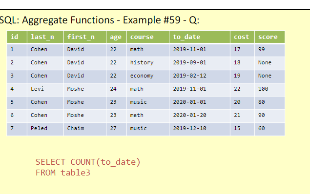
```
SELECT COUNT(to_date)
FROM table1
```
will count how many rows have a value in to_date col
and still return a table size of 1 on 1
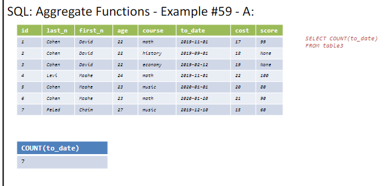

```
if there are empty values, it wont count them, so it makes a different on which col we do the SELECT COUNT()
same table as before
```
SELECT COUNT (score)
FROM table1
```
if we want all the rows without thinking about nulls etc we just do
```
SELECT COUNT(*)
FROM table1
```
some people do:
```
SELECT COUNT(1)
FROM table1
```
the proffesor doesnt like this option, but it is a valid one
so basicly created a table with with a new col with all the values is 1, so than it will count this, so technically SELECT COUNT(0) still works the same way.

```
SELECT COUNT(*)
FROM table1
WHERE score > 80
```
pay attenion first the where does its job, and than the count does its job.
this will count all rows where the score is bigger than 80
    
```
SELECT MIN(score), AVG(score), MAX(score)
FROM table1
```
this will return a table with 3 cols, the min, avg and max of the score col

```
```
SELECT SUM(cost) , GROUP_CONCAT(course)
FROM table1
``` 
this will return a table with 2 cols, the sum of the cost col and a string of all the courses in the course col


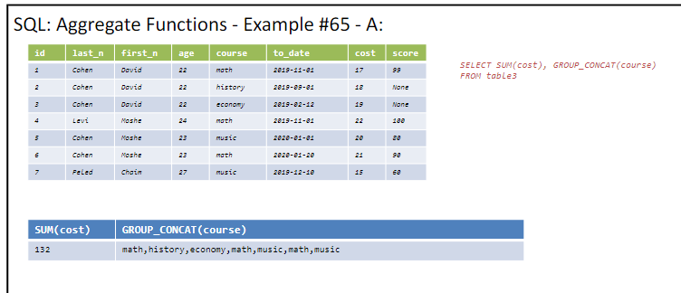
pay atteinion the concat does with , it isnt pure string concat.
also math is shown twice, so if there multiply showing he will concat them, if we dont want them we need to use distinct

this is very similar to COUNT(1)
```
SELECT SUM(1) 
FROM country
```

here concat only the disticint ones
also count the distinct one
```
SELECT COUNT(DISTINCT course), GROUP_CONCAT(DISTINCT course)
FROM table1
```
return value:
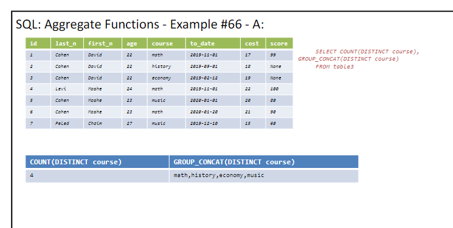

### Subqueries
we ran a small query inside our query
```
SELECT *
FROM table1
WHERE score > (SELECT AVG(score) FROM table1 
               WHERE id = 6 )
```
for this table:
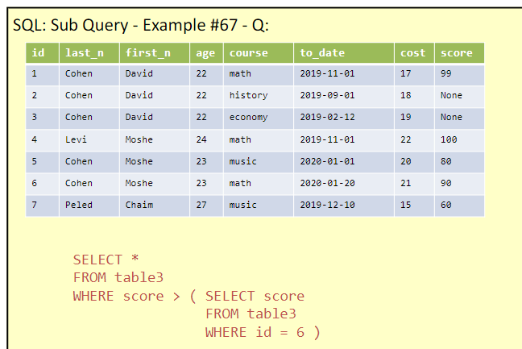
results:
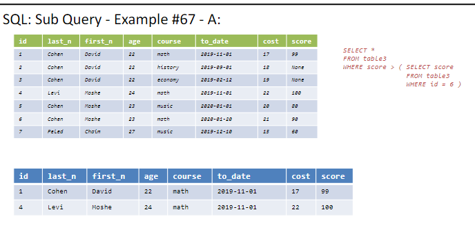
so we got all the info, about those who their score is higher than 90 which is the score of id = 6
another example:
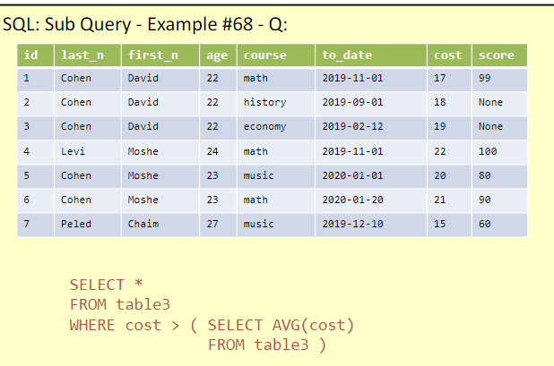

```
SELECT *
FROM table1
WHERE cost> (SELECT AVG(cost) FROM table1)
```
we must make sure the inner query gives back a table size 1X1 so it would know how to compare it to the outer query

if we ran this on this table:
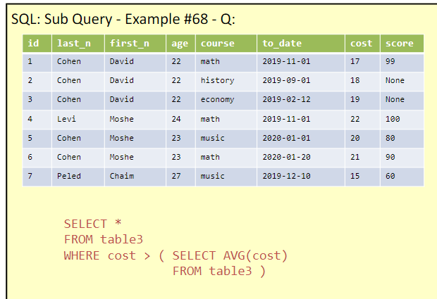
the results:
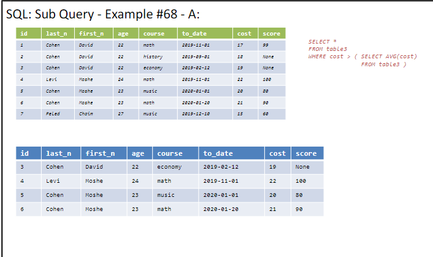
so we got all the info, about those who their cost is higher than the avg cost of all the table
*important, the inner querry must return only 1 value!!
** another example, we are not allowed to do
```
SELECT AVG(cost),*
FROM table1
```
this is wrong, cus avg give us a 1X1 table, and than we ask for all the col and rows, so this is a MISTAKE

another example:
```
SELECT id, last_n,course
from table1
WHERE cost = (SELECT MAX(cost) FROM table1)
```
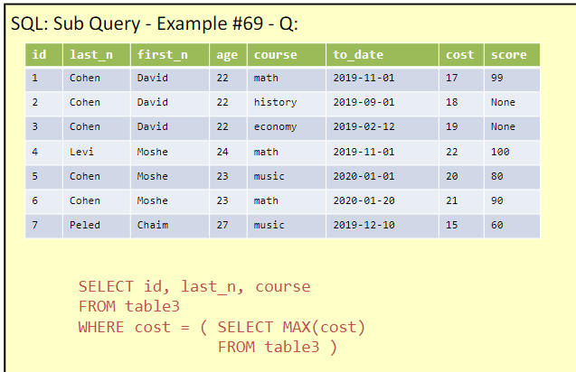
results:
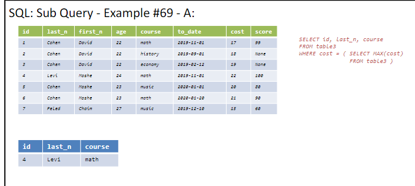
so we got the col id,last_n and course, about those who their cost is the max cost in the table 

another example abit harder example:

```
SELECT *
FROM table1 out_t1
WHERE cost = (SELECT MAX(cost) 
            FROM table1
            WHERE course = out_t1.course)
```
why we gave the table name here?
we want to compare the highest score,in students which attend the same course so basicly this runs like a double for loop, will compare them.
so we will get the highest score of each course
and we will get all the info about those who got the highest score in their course
it will not return the none values, so we wont get lines for the courses history and economy
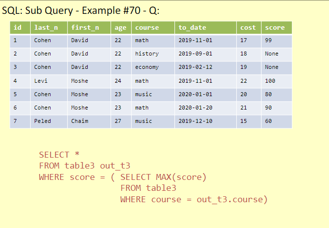

results:
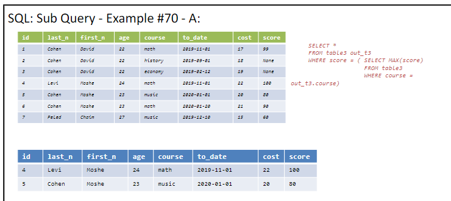

### in - subqueries
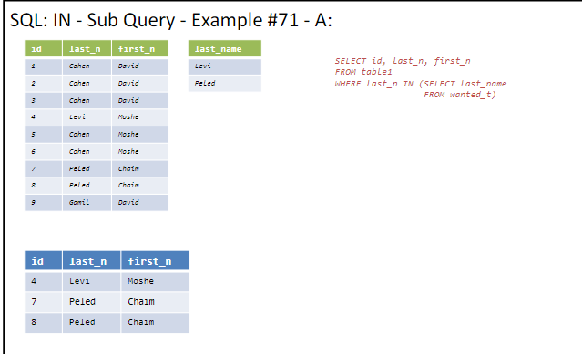
```
SELECT id,last_n,first_n
FROM table1
WHERE last_n IN (SELECT last_name from wanted_T)
```

### exists - subqueries
exists not only check against a static table, i actually check the original table in comparsion to the subquery
basicly we can do more complicated wheres with exists
```
SELECT id,last_n,first_n
FROM table1
WHERE EXISTS (SELECT * 
             FROM wanted_T
             WHERE last_name = table1.last_n)
```
would be better to not use SELECT * in the inner query, but to use SELECT 1


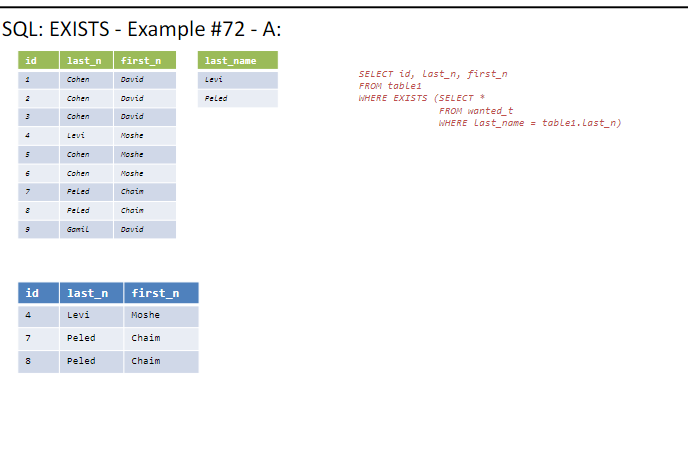

### union
the order of the cols must be the same in both tables
and the amount of cols must be the same in both tables

also limit and union is a bit problematic we has shown in class.
we can do LIMIT on the results of the union and not on a single of them.

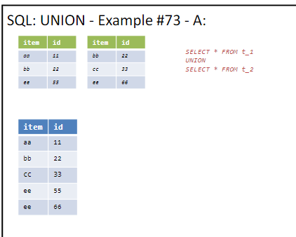
```
SELECT *
FROM table1
UNION
SELECT *
FROM table2
```
this union will return all the rows from table1 and table2, but if there are duplicates it will remove them

union all
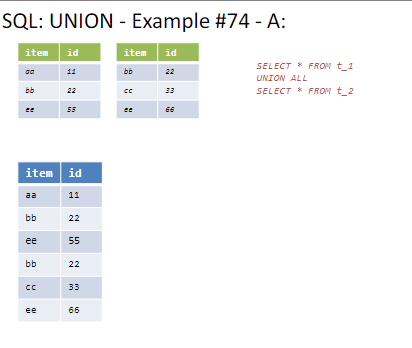
```
SELECT *
FROM table1
UNION ALL
SELECT *
FROM table2
```
union all will not remove duplicates

### intersect
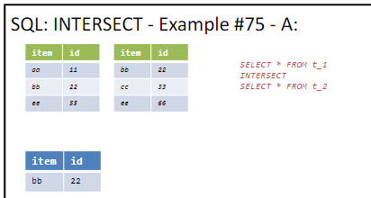
```
SELECT *
FROM table1
INTERSECT
SELECT *
FROM table2
```
so only the rows that are in both tables will be returned

### except
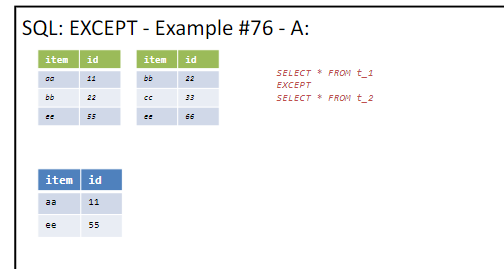
```
SELECT *
FROM table1
EXCEPT
SELECT *
FROM table2
```
so only the rows that are in table1 and not in table2 will be returned (atleast 1 col need to be diff)


