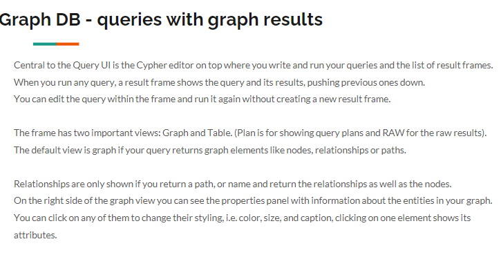

# Lesson Notes

## Seventh lesson 8.5.24

## Author's 

This document was written by Yaniv Gabay. While every effort has been made to ensure the accuracy and completeness of this material, it is possible that it may contain errors or omissions. Readers are advised to use this material as a general guide and to verify information with appropriate professional sources.
in order to see the pictures taken from the presentation, please make sure you cloned the pictures themselves.

## Previous Lesson Recap


### Document Store - Graph DB
a graph databse stores nodes and relationships instead of tables or documents.
data is stores just like you might sketch ideas on a whiteboard. your data is stores without restircting to a pre defined model, allowing a ver flexiable way of thinking about and using it.

### Graph DB - why?


### Graph DB - Neo4j


Nodes are also referred to as vertices or points
Relationships are also referred to as edges or lines links.
There is additional information, inside the nodes, and inside the edges.
### Naming Conventions

Node label - Camel Case :VehicleOwner
Relationship type - upper case, using underscore to separate words :OWNS_VEHICLE
Property - lower case camel case :firstName

### GraphDB Neo4j


rich eco system:
    

### GraphDB Cypher query languange
Cyper is an open data query language based on the openCypher initiative.
    


so gql (graph query lang) will be a new databse query languange.

### Cypher query fundamentals


### Cypher editor


### Graph DB queries tabuler results


### Graph DB example queries
will help us see the visualiztion of the data
```cypher
CALL db.schema.visualization()
```

```cyper
MATCH (p:Person) // we can also do (persons:Person)// the first variables is the name of the atble (or types we want to be called) second variable after: is the actual type of the node
RETURN *
LIMIT 9
```
```cyper
MATCH (p:Person)
RETURN p.name, p.born as born
LIMIT 9
```

```cper
MATCH (p:Person)
RETURN p //this will allow us to display a graph, cus we display all p
LIMIT 9
```


```cypher
MATCH (p:Person)
WHERE p.name = 'Tom Hanks' OR p.name = 'Rita Wilson'
RETURN p.name, p.born
```

```cypher
MATCH (p:Person)-[:ACTED_IN]->(m:Movie)
WHERE p.name = 'Tom Hanks'
RETURN m.title
```

```cypher
MATCH (p)-[:ACTED_IN]->(m:Movie)
WHERE p:Person AND m:Movie AND m.title = 'The Matrix'
return p.name
```

```cypher
MATCH (p:Person)-[:ACTED_IN]->(m:Movie)
WHERE 2000 <= m.released <= 2003
RETURN p.name, m.title, m.released
```
    
```cypher
MATCH (p:Person)-[:ACTED_IN]->(m:Movie)
WHERE p.name = 'Jack Nicholson' AND m.tagline IS NOT NULL
RETURN p.name, m.title, m.tagline
```

### Graph DB More example queries
```cypher
MATCH (p:Person)
WHERE p.born IN [1965, 1970, 1975]
RETURN p.name, p.born
```

```cypher
MATCH (p:Person)-[:ACTED_IN]->(m:Movie)
WHERE 'Neo' IN r.roles AND m.title = 'The Matrix'
RETURN p.name, m.title
```

```cypher
Proprties:
MATCH (p:Person)
RETURN p.name,keys(p)
```

```cypher
MATCH (p:Person)
WHERE p.born.year >1960
    AND p:Actor
    AND p:Director
RETURN p.name, p.born, labels(p)
```

### Graph DB More example queries (3)
```cypher
Schema:
CALL db.propertyKeys()
CALL db.schema.visualization()
CALL db.schema.nodeTypeProperties()
CALL db.schema.relTypeProperties()
```

```cypher
MATCH (p:Person)-[:ACTED_IN]->(m:Movie)<-[:DIRECTED]-(p)
WHERE p.born.year > 1960
RETURN p.name,p.born,labels(p),m.title
```

```cypher
MATCH (p:Person)-[r]->(m:Movie)
WHERE p.name = 'Tom Hanks'
RETURN m.title AS movie, type(r) AS reationship type

```

```cypher
MATCH (m:Movie)
WHERE "Israel" IN m.countries
RETURN m.title, m.language, m.countries
```

```cypher
MATCH (p:Actor | Person)
RETURN DISTINCT labels(p)
```

```cypher
MATCH (p:Person)
WHERE p:Actor and p:Person
RETURN DISTINCT labels(p)
```

### Graph DB More example queries (4) and strings
```cypher
MATCH (m:Movie)
WHERE m.title STARTS WITH 'Toy Story'
RETURN m.title, m.released
```
    
```cypher
MATCH (m:Movie)
WHERE m.title CONTAINS 'River'
RETURN m.title, m.released
```
```cypher
MATCH (p:Person)-[:ACTED_IN]->()
WHERE toLower(p.name) STARTS WITH 'michael'
RETURN p.name
```
```cypher
MATCH (p:Person)
WHERE toUpper(p.name) ENDS WITH 'DEMILLE'
RETURN p.name
```