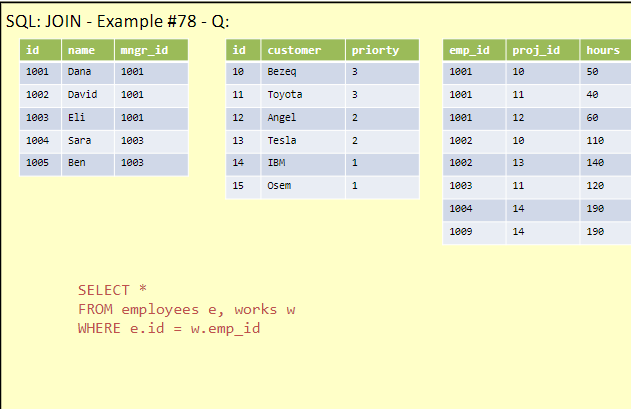

# Lesson Notes

## second lesson 10.4

## Author's Note

This document was written by Yaniv Gabay. While every effort has been made to ensure the accuracy and completeness of this material, it is possible that it may contain errors or omissions. Readers are advised to use this material as a general guide and to verify information with appropriate professional sources.
in order to see the pictures taken from the presentation, please make sure you cloned the pictures themselves.

## summary of last lesson
we went over the join statment
which is very important in SQL
so we have a col that connect between two tables
we will always need a common ground between the tables 
which is the col that we will join on

example of cartisian product using basic join:
    
the results
basicly we will get n*m rows in the new table


so if we want only to see the equals,so only when the ids are equal
we will do:
```sql
SELECT *
FROM employees e, works w
WHERE e.id = w.emp_id;
```
    
results:


### we stopped the last lesson at more join examples
join with on example:

important to name the tables, so e and p are the tables
the results:

important to notice, we got the same col, id= emp_id
for better, we should use specific select, and not just SELECT *


latest example was:

which is page 102 in LearnSQL.pdf
the results


teacher lesson example:
same example, with duplicate cols
```sql
SELECT *
FROM CountryLanguange cl
JOIN country co
ON cl.CountryCode = co.Code

```
so we can do:
```sql
SELECT cl.* , co.Name country_name
FROM CountryLanguange cl
JOIN country co
ON cl.CountryCode = co.Code

```
and this will give us all the cols from the cl table, and the country name from the co table


### self join
we can basicly do join on the same table
so we can do:
```sql
SELECT *
FROM employees e1
JOIN employees emp_mngr
ON e.mgr_id = emp_mngr.id
```
so the results of this, will give us the info, which is the manager of each employee. which we can see in the results of the query

the results:

 * we dont use the other tables they are just there

this is the same example, but choosing the new cols
based on logic, and not just show everything

```sql
SELECT e.id
        e.name emp_name
        emp_mngr.name manager_name
FROM employees e
JOIN employees emp_mngr
ON e.mgr_id = emp_mngr.id
```

###  now we talked about the diff between union union all intersect expect

so union will put the other table "below" the first table
but join, will join the cols togther.

UNION ALL will put the other table below the first table, but will not remove the duplicates

UNION without all, will remove the duplicates

INTERSECT will return only the rows that are in both tables

EXCEPT will return only the rows that are in the first table and not in the second table, similar to minus we do in set theory. 

### different between join operations


important when using left join, he will put values from the left table, and if there are no values in the right table, he will put NULL

How to do FULL JOIN?
do union (not all) of two left joins:
```sql
select*
FROM a
LEFT JOIN b
UNION 
select *
from B 
LEFT JOIN a
```


### at this point, we are at the new presenation, called SQL3

### Values
this will create a new table, with some data
we can do math operations inside the col.

```sql
SELECT * 
FROM (VALUES(1,2),(3,4),(5+6,8-7))
```


### With
this will give us that table with a name
so as a "variable" we can use it later in other queries

```sql
WITH tbl1(col1,col2) AS (VALUES(1,2),(3,4),(5+6,8-7))
SELECT *
FROM tbl1
```

   

### another example
this is helpfull, to work on created tables, before we want to work on the actual database etc

```sql
WITH tbl1(col1,col2) AS (VALUES(1,2),(3,4),(5+6,8-7)),
tbl2(col1,col2) AS (SELECT col1*2, col2*2 FROM tbl1)
SELECT *
FROM tbl2
```
Results:


### another example of CTE
### common table expression
```sql
WITH only_david AS (SELECT *
                     FROM employees
                      WHERE name = 'David')
SELECT COUNT(*),
      SUM(cost)
FROM only_david
```
results:
   

### group by
this is very important, we can use this to make action on some rows
```sql
SELECT course,
        COUNT(*),
        AVG(score)
FROM table1
GROUP BY course
ORDER BY 1
```
basicly, this will create groups based on the courses.
so for all the history rows, do the SELECT OPERATIONS, it is similar to distnict.

Results:


Group by is SUPER helpfull!!!

in the select with groupby, there can only be, the name of the group by argument, and argg functions

another example:
```sql
SELECT course, 
        MAX(cost) max_cost,
        MIN(age) min_age,
        ROUND(AVG(score),2) avg_score,
        GROUP_CONCAT(DISTINCT first_n||' '||
        SUBSTR(last_n,1,1)||'.') all_names
FROM table1
GROUP BY course
ORDER BY 1
```
important, order by 1 is to order it by the same col
maybe its better to write the col name itself
so ORDER BY course 
ORDER BY will order by the SELECT cols, not by the origina cols!!


much more simillar to real life queries we will run


