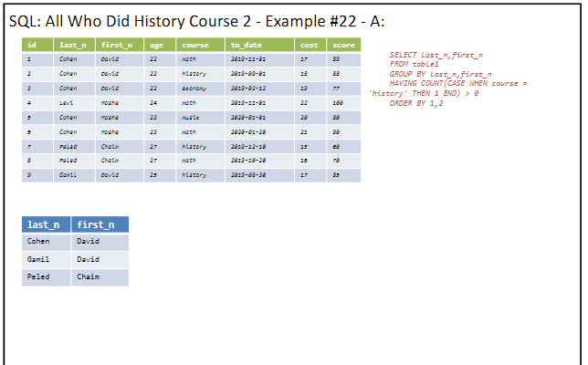

# Lesson Notes

## second lesson 10.4

## Author's Note

This document was written by Yaniv Gabay. While every effort has been made to ensure the accuracy and completeness of this material, it is possible that it may contain errors or omissions. Readers are advised to use this material as a general guide and to verify information with appropriate professional sources.
in order to see the pictures taken from the presentation, please make sure you cloned the pictures themselves.

## summary of last lesson
we went over the join statment
which is very important in SQL
so we have a col that connect between two tables
we will always need a common ground between the tables 
which is the col that we will join on

example of cartisian product using basic join:
    
the results
basicly we will get n*m rows in the new table


so if we want only to see the equals,so only when the ids are equal
we will do:
```sql
SELECT *
FROM employees e, works w
WHERE e.id = w.emp_id;
```
    
results:


### we stopped the last lesson at more join examples
join with on example:

important to name the tables, so e and p are the tables
the results:

important to notice, we got the same col, id= emp_id
for better, we should use specific select, and not just SELECT *


latest example was:

which is page 102 in LearnSQL.pdf
the results


teacher lesson example:
same example, with duplicate cols
```sql
SELECT *
FROM CountryLanguange cl
JOIN country co
ON cl.CountryCode = co.Code

```
so we can do:
```sql
SELECT cl.* , co.Name country_name
FROM CountryLanguange cl
JOIN country co
ON cl.CountryCode = co.Code

```
and this will give us all the cols from the cl table, and the country name from the co table


### self join
we can basicly do join on the same table
so we can do:
```sql
SELECT *
FROM employees e1
JOIN employees emp_mngr
ON e.mgr_id = emp_mngr.id
```
so the results of this, will give us the info, which is the manager of each employee. which we can see in the results of the query

the results:

 * we dont use the other tables they are just there

this is the same example, but choosing the new cols
based on logic, and not just show everything

```sql
SELECT e.id
        e.name emp_name
        emp_mngr.name manager_name
FROM employees e
JOIN employees emp_mngr
ON e.mgr_id = emp_mngr.id
```

###  now we talked about the diff between union union all intersect expect

so union will put the other table "below" the first table
but join, will join the cols togther.

UNION ALL will put the other table below the first table, but will not remove the duplicates

UNION without all, will remove the duplicates

INTERSECT will return only the rows that are in both tables

EXCEPT will return only the rows that are in the first table and not in the second table, similar to minus we do in set theory. 

### different between join operations


important when using left join, he will put values from the left table, and if there are no values in the right table, he will put NULL

How to do FULL JOIN?
do union (not all) of two left joins:
```sql
select*
FROM a
LEFT JOIN b
UNION 
select *
from B 
LEFT JOIN a
```


### at this point, we are at the new presenation, called SQL3

### Values
this will create a new table, with some data
we can do math operations inside the col.

```sql
SELECT * 
FROM (VALUES(1,2),(3,4),(5+6,8-7))
```


### With
this will give us that table with a name
so as a "variable" we can use it later in other queries

```sql
WITH tbl1(col1,col2) AS (VALUES(1,2),(3,4),(5+6,8-7))
SELECT *
FROM tbl1
```

   

### another example
this is helpfull, to work on created tables, before we want to work on the actual database etc

```sql
WITH tbl1(col1,col2) AS (VALUES(1,2),(3,4),(5+6,8-7)),
tbl2(col1,col2) AS (SELECT col1*2, col2*2 FROM tbl1)
SELECT *
FROM tbl2
```
Results:


### another example of CTE
### common table expression
```sql
WITH only_david AS (SELECT *
                     FROM employees
                      WHERE name = 'David')
SELECT COUNT(*),
      SUM(cost)
FROM only_david
```
results:
   

### group by
this is very important, we can use this to make action on some rows
```sql
SELECT course,
        COUNT(*),
        AVG(score)
FROM table1
GROUP BY course
ORDER BY 1
```
basicly, this will create groups based on the courses.
so for all the history rows, do the SELECT OPERATIONS, it is similar to distnict.

Results:


Group by is SUPER helpfull!!!

in the select with groupby, there can only be, the name of the group by argument, and argg functions

another example:
```sql
SELECT course, 
        MAX(cost) max_cost,
        MIN(age) min_age,
        ROUND(AVG(score),2) avg_score,
        GROUP_CONCAT(DISTINCT first_n||' '||
        SUBSTR(last_n,1,1)||'.') all_names
FROM table1
GROUP BY course
ORDER BY 1
```
important, order by 1 is to order it by the same col
maybe its better to write the col name itself
so ORDER BY course 
ORDER BY will order by the SELECT cols, not by the origina cols!!


much more simillar to real life queries we will run

### another example of GROUPBY
we can group by even 2 groups.
```sql
SELECT first_n,last_n,
        AVG(score),
        SUM(cost)
FROM table1
GROUP BY first_n,last_n
ORDER BY 1,2
```
the results:

 
 will create a distnict group based on the first and last name
 very important and useful.

 ### next example
 
results:


same as DISTINCT. 

### Having
this is like where, but for the group by
where will help us filter rows.
having will help us filter groups
so if course, give us 4 groups of courses,
having will help us filter those groups, that their count is atleast 1! and we must use AGG functions in the having, cause it is a term on GROUPS and not on ROWS
```sql
SELECT course,
        COUNT(*)
        AVG(score)
FROM table1
GROUP BY course
HAVING COUNT(*) > 1
```


### another example
we can also use where, but only after the results of the first querry,
cus where will act even before the group by, so its WRONG to use where before the group by
```sql
WITH  count_course AS (
        SELECT course, COUNT(*) cc, AVG(score)
        FROM table1
        GROUP BY course
)
SELECT *
FROM count_course
WHERE cc > 1

```
it is the same as the having, but we can use where, after the group by, and not before.
less usefull,more code,less effiecnt,better to use HAVING

### FILTER

```sql
SELECT 'age gt 22' kind, 
    COUNT(*)    val
FROM table1
WHERE age > 22
UNION ALL
SELECT 'score lt 80' kind, 
    COUNT(*)      val
FROM table1
WHERE score < 80
```
this is a query, of how many people are age > 22 and score < 80
the results is:


we can do the same with join
```sql
SELECT * 
FROM  ( SELECT COUNT(*) high_age 
        FROM table1
        WHERE age > 22 ),
        ( SELECT COUNT(*) low_score
        FROM table1
        WHERE score < 80 )
```
this is an invisible join,with the ,
results:
   

with the join method:
```sql
SELECT * 
FROM  ( SELECT COUNT(*) high_age 
        FROM table1
        WHERE age > 22 )
JOIN  ( SELECT COUNT(*) low_score
        FROM table1
        WHERE score < 80 )
ON True -- or you can write 1 | 1=1 | etc..
```

results:
   

the filter itself example:

```sql
SELECT COUNT(*) FILTER (WHERE age > 22) high_age,
        COUNT(*) FILTER (WHERE score < 80) low_score
FROM table1
```
results:
   

another example:
now we will do the same as the last example, but with group by
```sql
SELECT course,
        COUNT(*) FILTER (WHERE age > 22) high_age,
        COUNT(*) FILTER (WHERE score < 80) low_score
FROM table1
GROUP BY course
```
results:


### another example
this is an example, of using the CASE WHEN instead of filter
if there is a version of SQL without filter.
so here, we will change the values, and than count
than we Bypass the filter method.
```sql
SELECT course,
        COUNT(CASE WHEN age > 22 THEN 1 ELSE NULL END) high_age,
        COUNT(CASE WHEN score < 80 THEN 1 END) low_score
FROM table1
GROUP BY course
```
results:


### another example
this will show us the percentage of the history course from the total score
```sql
SELECT 
    1.0 * SUM(score) / (SELECT SUM(score) FROM table1)
FROM table1
WHERE course = 'history'
```
Results:


but we can use the FILTER method, to do the same
```sql
SELECT 
    1.0 * SUM(score) FILTER (WHERE course = 'history') / 
    SUM(score)
FROM table1
```

take the sum of score, where the course is history, and divide it by the sum of all the scores

results:


### important note
very important before trying to write the query
to try to think how many rows and cols we need
less? more?


### Syntax full
```sql
SELECT [DISTINCT] <colms|func|agg|won>      4/6/7/8
FROM <table> [JOIN <table>]                  1
WHERE < conditions on rows>                  2
GROUP BY <columns>                           3
HAVING <predicate on groups>                 5
ORDER BY <colums>                            10
OFFSET <num>                                 11
LIMIT <num>                                  12
```

the right col is the order of the actions.

###  SQL QUERY EXECUTION ORDER


### Q&A

```sql
SELECT DISTINCT last_n,first_n
FROM table1
WHERE course = 'history'
ORDER BY 1,2
```


results:


### another example
all those WHO DIDNT DO HISTORY COURSE
```sql
SELECT DISTINCT last_n,first_n
FROM table1
WHERE course != 'history'
ORDER BY 1,2
```

results:

is not good, cause we have a lot of duplicates, david cohen did history and math, we want those who DIDNT do history

so the better query is: (or the correct one)
```sql
SELECT last_n,first_n
FROM table1
GROUP BY last_n,first_n
HAVING COUNT(CASE WHEN course = 'history' THEN 1 END) = 0
ORDER BY 1,2
```

results:


so basicly , when there is a group, who has a history course, we will not show them, and we will show only groups, which dont have a history course.

### another example
All who did history course 2
```sql
SELECT last_n,first_n
FROM table1
GROUP BY last_n,first_n
HAVING COUNT(CASE WHEN course = 'history' THEN 1 END) > 0
ORDER BY 1,2
```
results:


### another example
How many did not do history course
```sql
SELECT COUNT(*)
FROM table1
GROUP BY last_n,first_n
HAVING COUNT(CASE WHEN course = 'history' THEN 1 END) = 0
```
results:
   
results are bad!!!.

we can debug using group_concat


so we can see the results, and see that the group by is not working as we thought, so we need to change the query

```sql
WITH  no_history AS (
        SELECT last_n,first_n
        FROM table1
        GROUP BY last_n,first_n
        HAVING COUNT(CASE WHEN course = 'history' THEN 1 END) = 0
)
SELECT count(*) 
FROM no_history
```
this is correct, cus first, we will get all the people who didnt do history, and only than we count them.

the lesson is, we need to split the query to two parts, and not to do everything in one query.

results:


### another example
what courses peled chaim did


```sql
SELECT DISTINCT course
FROM table1
WHERE last_n = 'peled' AND first_n = 'chaim'
```

results:


next
what courses  peled chaim DIDNT do
so just using NOT name peled is not right, cus there can be duplicates etc.
so the correct query is:
```sql
SELECT DISTINCT course
FROM table1
WHERE course NOT IN ( 
        SELECT DISTINCT course
        FROM table1
        WHERE last_n = 'Peled' AND first_n = 'Chaim' )
ORDER BY 1
```
first get us all the courses he first did, and than the disticnt courses which are not in the first query

results:


another query, to get the same results
```sql
SELECT course
FROM table1
GROUP BY course
HAVING COUNT(*) FILTER (WHERE last_n = 'Peled' 
                        AND first_n = 'Chaim') = 0 
ORDER BY 1
```
here we count, how many times peled chaim did the course, and if it is 0, we will show it.group by is distnict, so we will get the distnict courses

who did math OR history course

```sql
SELECT DISTINCT last_n,first_n
FROM table1
WHERE course = 'math' or course = 'history'
ORDER BY 1
```
results:


WHO DID MATH AND HISTORY
this will return empty table
```sql

SELECT DISTINCT last_n,first_n
FROM table1
WHERE course = 'math' and course = 'history'
ORDER BY 1
```
so this is NOT good
we should do:

```sql
SELECT last_n,first_n
FROM table1
GROUP BY last_n,first_n
HAVING COUNT(*) FILTER (WHERE course = 'math') > 0 
AND 
COUNT(*) FILTER (WHERE course = 'history') > 0
ORDER BY 1
```
results:


we can do the previous OR history or Math
we can do it more complicated


```sql
SELECT last_n,first_n
FROM table1
GROUP BY last_n,first_n
HAVING COUNT(*) FILTER (WHERE course = 'math') > 0 
        OR 
        COUNT(*) FILTER (WHERE course = 'history') > 0
ORDER BY 1
```

its important to look at a person as a group, and than to do the filter on the group, and not on the rows.

results:


### Average with NULL
results:


if we want the average without the nulls values its really nice to use
COALESCE
so:
```sql
SELECT COUNT(COALESCE(score,0)), AVG(COALESCE(score,0))
FROM table3
```
results:
   

### rolling sum

   
we do self join.
```sql
SELECT *
FROM sales s1 
JOIN sales s2 
    ON s1.day >= s2.day
ORDER BY 1,3
```

results:


so for each day, we will get all the previous days.

so to do the rolling sum, we can do:
```sql

SELECT s1.day, SUM(s2.amount)  
FROM sales s1 
JOIN sales s2 
ON s1.day >= s2.day
GROUP BY s1.day
ORDER BY 1
```

results:


### advanced example of window function:
```sql
SELECT *, 
    SUM(amount) OVER (ORDER BY day)  
FROM sales s1 
ORDER BY 1
```

we will learn this after pesah
results:
   

### example something we might think is good but is bad:


works by accident in other SQL servers this will return an error

CONCLUSION:::


so how to do it
```sql
SELECT id,last_n,first_n
FROM table1
WHERE score = (SELECT MAX(score) FROM table1)
```


some sql servers have max_by functions, which will return the relavnt cols with the results , but we dot have in SQLLITE

### name and id of 2 highest score
```sql
SELECT id,last_n,first_n, score
FROM table1
ORDER BY score DESC
LIMIT 2
```
results:
   

for the highest just limit 1 etc.

### get MIN MAx IN 2 COLS
JUST 2 SELECT

### get MIN MAx IN 2 rows
UNION

### NEXT LESSON
### COUNT DUPLICATE LINES 1
